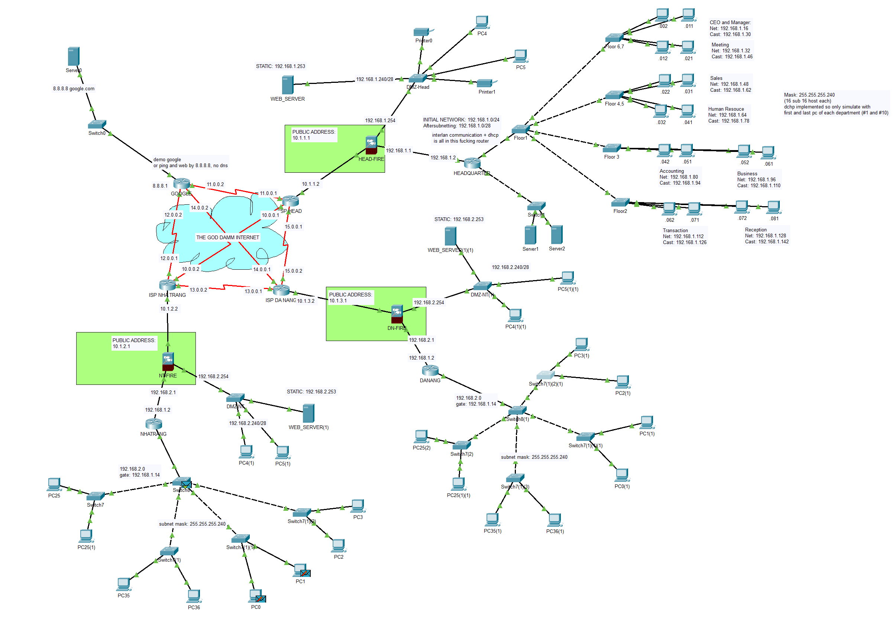
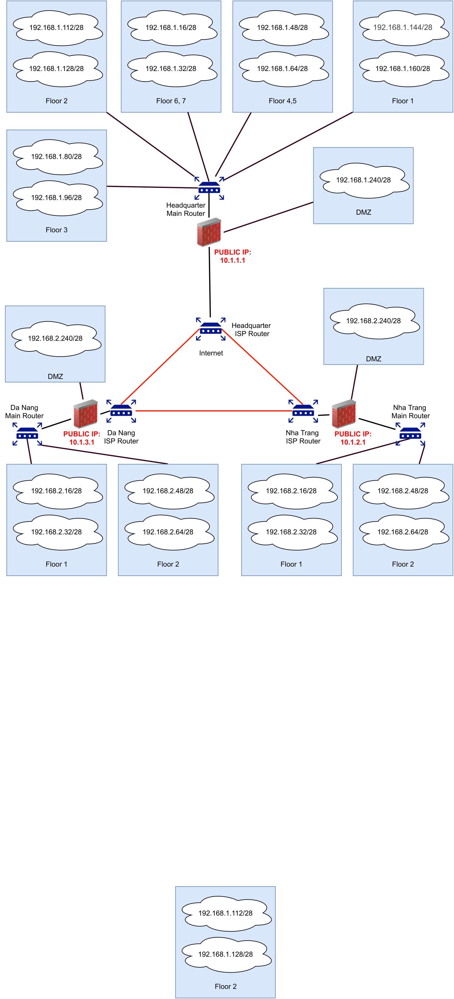
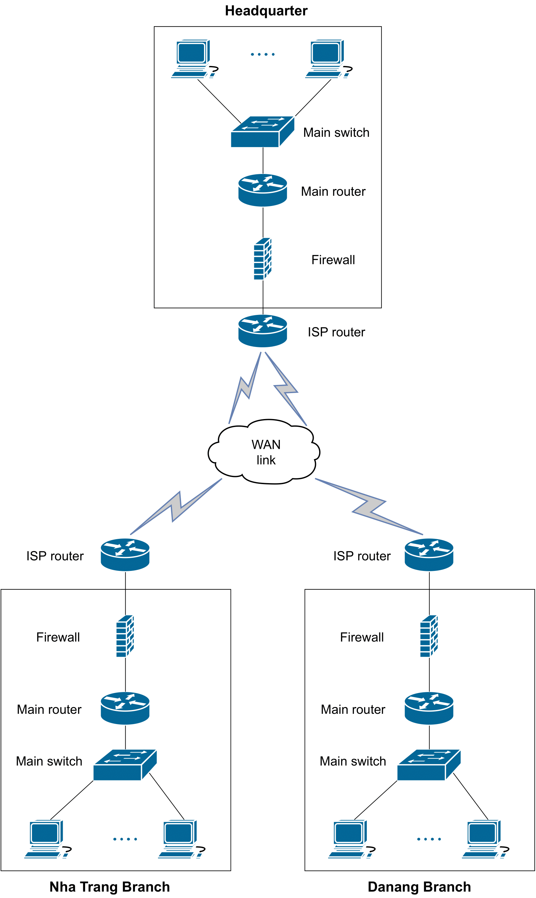

# Company Network Design

**Description:**

In this project, we design a company's networking system based on the requirements gathered.

Detailed report can be found [here](https://www.overleaf.com/read/gqyxngzhkhhx)

    

## General Information

- We design the system for 3 locations of a company with 7 floors on the main site and 2 floor each on smaller company's branches
- Design takes into inner network, outer network
- Firewall is setup between inner and outer networks
- DMZ is also considered for extra security
- Wan connection between branches is through ADSL
- We also keep in mind future expansion of the company
- And calculate throughput for bandwidth determination
- Simulation and testing is done using GNS3 network simulation program

## Details

1. IP Diagram
   
2. WAN Diagram
   
3. More info in the report

## Usage

> To test the simulation out yourself, you can download GNS3 and import the `proj.pkt` file and start messing around

> I've also put notes within the file itself for further instructions

## Future Improvements

- Better wan simulation
- Re-organizing networks
